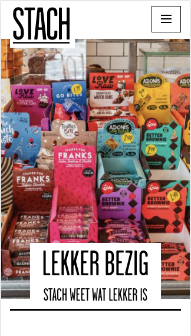
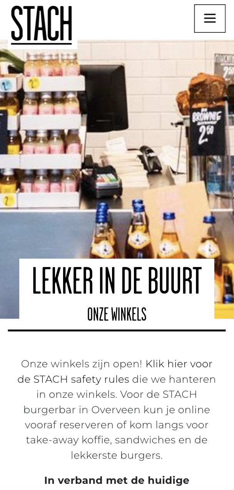
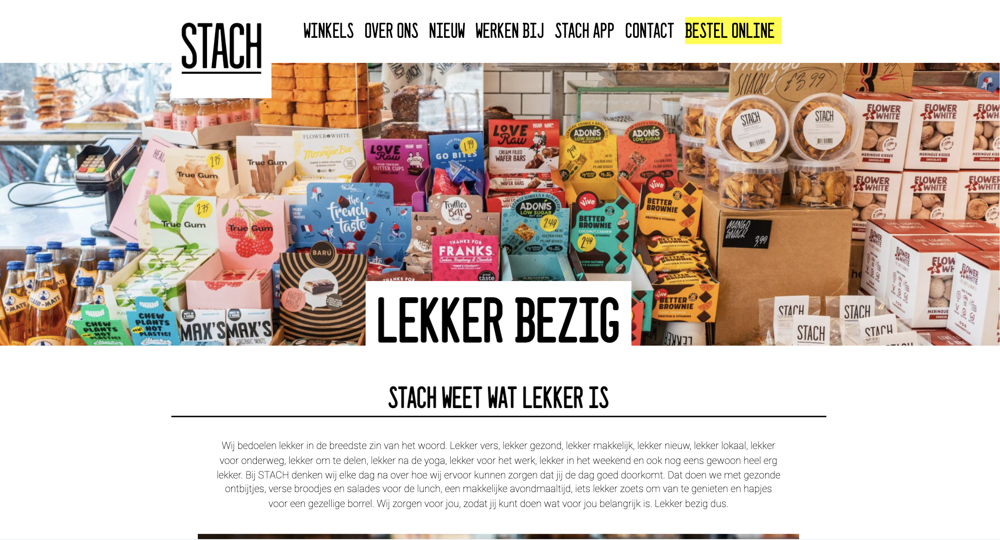
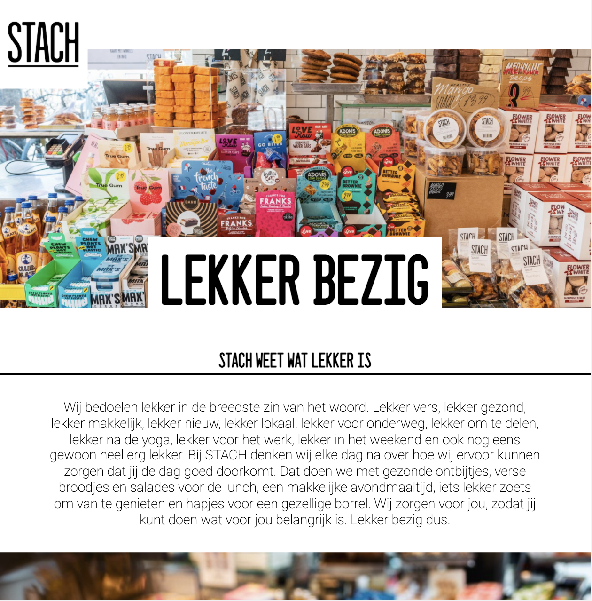
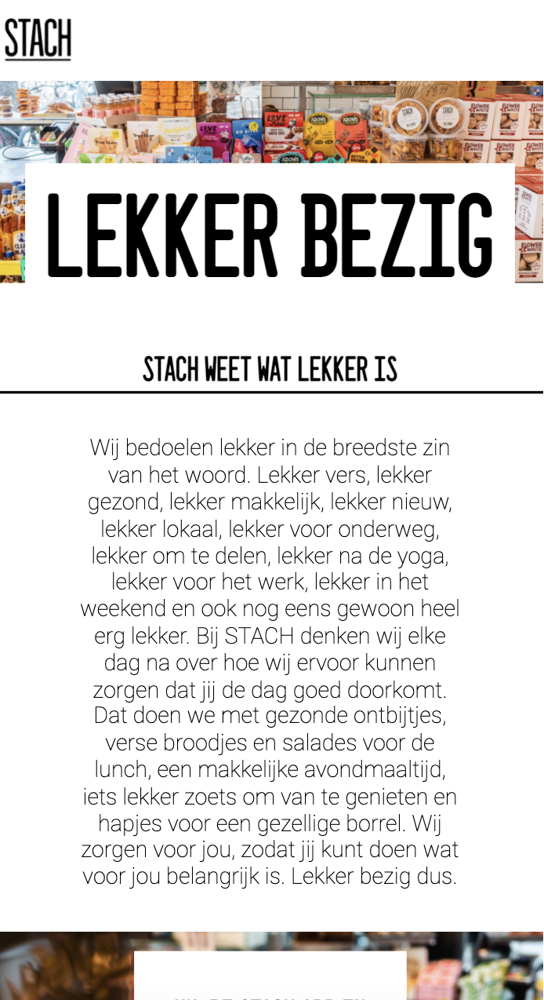
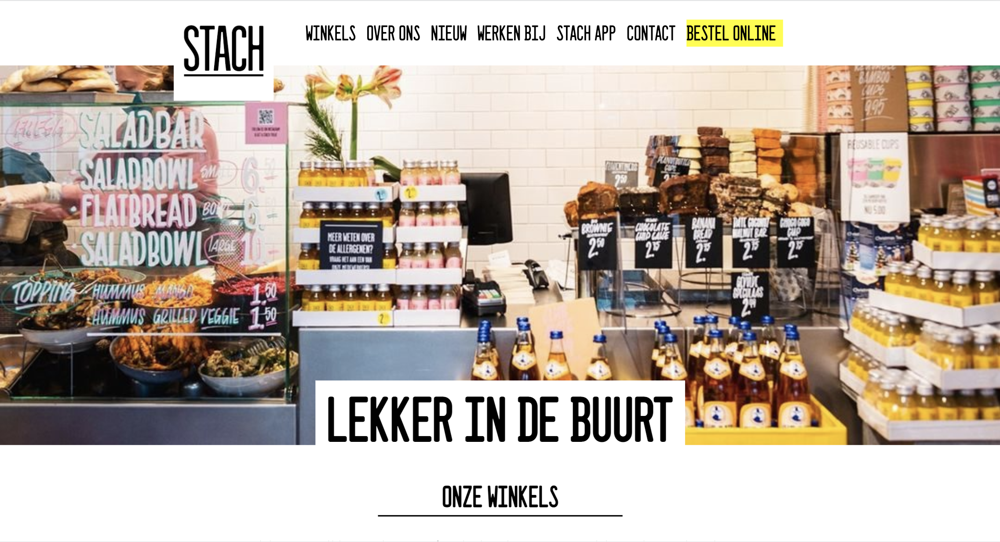
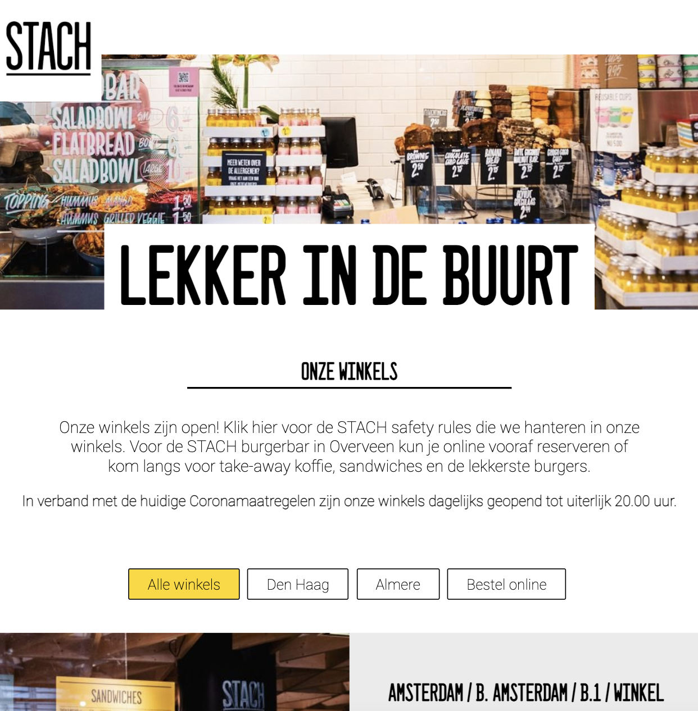
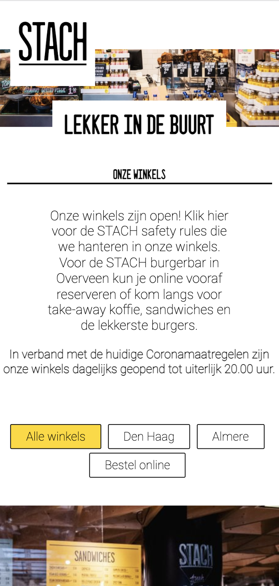

# Procesverslag
Markdown is een simpele manier om HTML te schrijven.  
Markdown cheat cheet: [Hulp bij het schrijven van Markdown](https://github.com/adam-p/markdown-here/wiki/Markdown-Cheatsheet).

Nb. De standaardstructuur en de spartaanse opmaak van de README.md zijn helemaal prima. Het gaat om de inhoud van je procesverslag. Besteedt de tijd voor pracht en praal aan je website.

Nb. Door *open* toe te voegen aan een *details* element kun je deze standaard open zetten. Fijn om dat steeds voor de relevante stuk(ken) te doen.

## Je website

uitwerken voor kick-off werkgroep

### Je opdracht:
link naar de website die je gaat namaken óf de naam/omschrijving van je eigen ontwerp

#### Screenshot(s) van de eerste pagina (small screen): 
Home pagina  

#### Screenshot(s) van de tweede pagina (small screen):
Nieuwe prodcuten pagina  

 

## Toegankelijkheidstest

- Ik heb de code door de W3C validator gehaald en geen problemen gedetecteerd.
- Ik heb commentaar geschreven zodat mijn website makkelijk overgedragen kan worden.

## Eindgesprek

uitwerken voor eindgesprek

### Stand van zaken
De HTML heb ik over het algemeen wel goed onder de knie, maar CSS is voor mij altijd heel erg lastig. Dit komt omdat ik altijd moeilijk vindt welke combinaties ik moet gebruiken. Als ik geholpen wordt door iemand, dan denk ik daarna; "oooohhh zo moest dat, dat is eigenlijk helemaal niet zo lastig, maar zou er zelf gewoon niet meteen op komen". Daarnaast liep ik soms vast bij de verschillende dingen die je kunt gebruiken om dingen te vergroten en verkleinen: rem, em, px en %.

Niet alles is perfect gelukt zoals ik zou willen. Dat vindt ik heel vervelend omdat ik me daar dan heel erg aan kan ergeren.
Toch heb ik geprobeerd de site zo goed mogelijk na te maken en ik ben eerlijk gezegd best wel trots dat ik dit heb gemaakt na 3 jaar heel veel moeite te hebben met de stof. Dit jaar heb ik meer tijd eraan besteed, de boeken weer gebruikt en meer hulp gevraagd als ik vastliep.

### Screenshot(s)

hier screenshot(s) van je eindresultaat
 
 HOME
 
 Home pagina desktop 

 Home pagina Ipad

 
 Home pagina Iphone 

 
 WINKELS
 Winkel pagina desktop 

 
 Winkel pagina Ipad 

 
 Winkel pagina Iphone 

## Bronnenlijst

continu bijhouden terwijl je werkt

Nb. Wees specifiek ('css-tricks' als bron is bijv. niet specifiek genoeg).

1. Tess Smit hulp met logo kloppend krijgen in de navigatiebalk.
2. Hulp met verschil tussen em en rem: https://zellwk.com/blog/rem-vs-em/
3. Omrekenen px naar rem: https://nekocalc.com/px-to-rem-converter
4. CSS volgorde: https://codepen.io/joostf/pen/xEpmLx
5. Guus Maij voor hulp met CSS (Media query) en Javascript.
6. Flexbox in CSS: https://css-tricks.com/snippets/css/a-guide-to-flexbox/
7. Z-index: https://www.w3schools.com/cssref/pr_pos_z-index.asp
8. Oefening van Janno: https://flexboxfroggy.com/#nl
9. HTML & CSS: Design and Build Web Sites, Jon Duckett
10. JavaScript & Jquery: Interactive Front-End Web Development, Jon Duckett
11. Afbeeldingen slider: https://www.educba.com/javascript-image-slider
 

